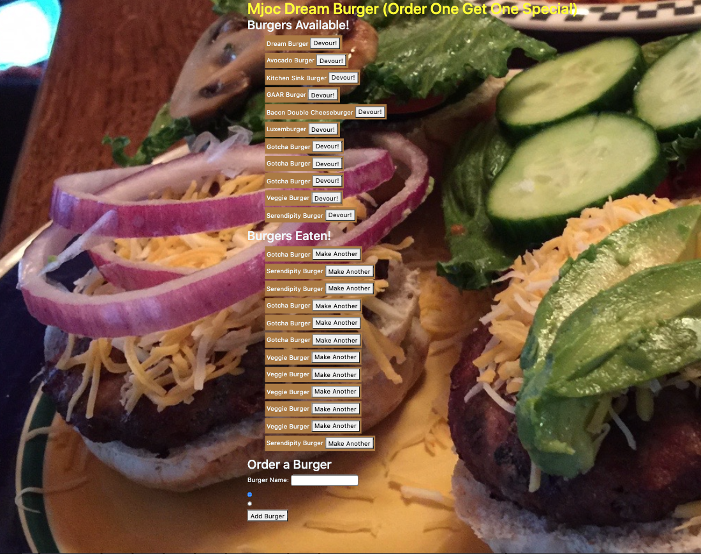

# Assignment13
This is the repo for Assignment 13, Node Express Handlebars due February 26, 2021.

Submitted: March 27, 2021, Michael O'Connor, 604 765-6061

# 01 Goal: 

    The goal of this project is to create create a burger logger with MySQL, Node, Express, Handlebars and a homemade ORM (yum!). We must follow the MVC design pattern; use Node and MySQL to query and route data in your app, and Handlebars to generate your HTML. Here is the url to the Github folder https://github.com/Emjayosee/13_Handlebars
    and the url to the deployed website https://mjocburgers.herokuapp.com/.

# 02 Approach:

    In approaching the project, I had to weigh tacking this old project or tacklig number 21.  AT first I thought 
    the material for 21 was more current, then I decided to read Handlebars and it gave a complete step by step. 
    I was alert to an activity, CATS APP in the material and it looked like there was some in common so I built 
    the step by step, watched the class on mysql and handlebars (which I feared) and endpoints and by Friday 
    night, I had something that was shaping up.  I added some code this morning and was able to get it to 
    render, then starting tweaking it all through the day.  But I knew I needed some TA assistance and my 
    assigned tutor had exited the porgram.  Just as I was loading it in Heroku, around 3 pm Saturday, I was 
    able to get some help from Luca on some of the aspects that were not functioning on Heroku, and he applied 
    the JAWSDB of life and made it work.  I recall doing that in our project 2.  I messed it up after Luca left 
    and he came back and restored it laet in the evening. Thanks, Luca.

        1. When the user loads the page, the user should be able to:

            - create the structure of files as specified in the required. [X]
            
            - When a user submits a burger's name, your app will display the burger
             on the left side (I did the top)  of the page -- waiting to be devoured. [X]

            - Each burger in the waiting area (I called it Burgers Available) also has
              a `Devour it!` button. When the user clicks it, the burger will move to the 
              right side (I used the bottom) of the page. [x]
              
            - The app  store every burger in a SQL database, whether devoured or not.[X]

            - I noted that it was "Order One Get ONe" cuz I could not figure out
                why the order button created two burgers each time! NOr do I have anymore
                time, after I corrupted the database and my TA had to help
                me recover. [X]

            - Make it work on SQL linked to Heroku via JAWSDB. [X]

        2. Update GitHub repository [X]

        3. Deploy this site to Heroku [X]

        4. Add a two for one burger picture of my own home made "Dream Burger" as a background. [X]

# 03 Testing and Quality Control:

    1. Test each of the criteria to confirm functionality.

    2. Connect to Heroku/SWL/GITHUB.
    
    3. Load the files and tested the page functionality at HEROKU.

# 04 Lessons Learned:

The following lessons learned:

    1. What an endpoint is.

    2. How Heroku and JAWSDB fit with Github and MySQL Workbench.

    3. Why to be careful switching between my laptop and desktop.

    4. Why not to maintain two databases with same name on different sources (AGHGGHHHHH!)

# 05 Further improvements to make:

The following items should be considered for future enhancements, time and budget permitting:

    1. Add a delete button.

    2. Remove the two bullet radio buttons at bottom.

    3. Add a sticky nav bar and some instructions.

# 06 Current Renderings:

See Current Rendering at the time of writing in the Assignment19 Repo. 

